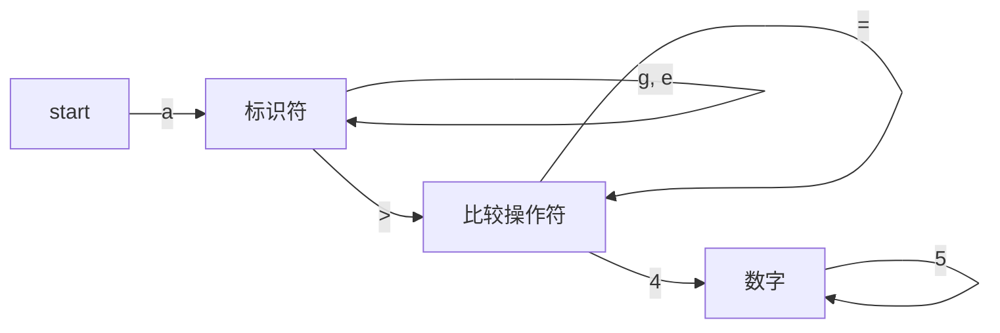

词法分析是将代码分割为 Token 的过程。

以 `age >= 45` 这个表达式为例，分割 Token 的过程可以通过以下状态机表示：

那么怎么识别出来这一个个 Token 呢？通过什么方法把识别出来的 Token 从代码中分割出来？

## 正则表达式

通过正则表达式，就可以识别出不同类型的 Token。

以数字整型 `Integer` 为例，正则表达式为 `/^[0-9]+$/`。

## 有限自动机（FSA)
